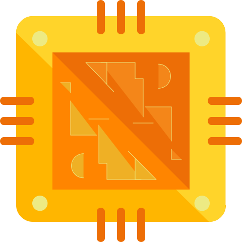

  <picture>
    
  </picture>
 

<h2>Rocket 68</h2>

A Motorola 68000 CPU emulator in C

---

Rocket 68 is a Motorola 68000 CPU emulator written in pure C11.
It supports all the instructions and addressing modes of the 68000 CPU, plus system control features like supervisor mode, interrupts, and exceptions.
It is also runs as a similar clock cycle to the real 68000 CPU with very good accuracy.

### Features

- Have a simple API and easy to integrate into other projects
- Supports all Motorola 68000 instructions and different addressing modes
- Near-exact cycle timing (which means emulation speed is very close to the real 68000 CPU clock speed)
- Full hardware interrupt support (with auto-vectoring, address error traps, trace mode, and halted states)
- Built-in instruction disassembler and support for loading binary and S-record programs

See [ROADMAP.md](ROADMAP.md) for the list of implemented and planned features.

> [!IMPORTANT]
> This project is in early development, so bugs and breaking changes are expected.
> Please use the [issues page](https://github.com/habedi/rocket68/issues) to report bugs or request features.

---

### Quickstart

To be added.

---

### Documentation

The project documentation is available [here](https://habedi.github.io/rocket68/).
The detailed API documentation (generated with Doxygen) is available [here](https://habedi.github.io/rocket68/doxygen/index.html).

### Benchmarks

The [benches](benches) directory contains benchmarks for comparing Rocket 68 with other emulators.

---

### Contributing

See [CONTRIBUTING.md](CONTRIBUTING.md) for details on how to make a contribution.

### License

This project is licensed under the MIT License (see [LICENSE](LICENSE)).

### Acknowledgements

- The logo is from [SVG Repo](https://www.svgrepo.com/svg/142843/cpu) with some modifications.
- Tests (code and data) from the following projects were used to verify the correctness of Rocket 68:
    - [Musashi](https://github.com/kstenerud/Musashi)
    - [68k-bcd-verifier](https://github.com/flamewing/68k-bcd-verifier)
    - [m68000](https://github.com/SingleStepTests/m68000)

### References

- [M68000 Family Programmer's Reference Manual](https://www.nxp.com/docs/en/reference-manual/M68000PRM.pdf)
- [Motorola 68000 Opcodes](http://goldencrystal.free.fr/M68kOpcodes.pdf)
